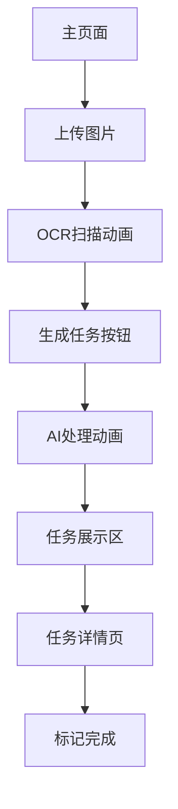

## 1. 产品概述
Life Copilot 是一款游戏化任务管理 Web 应用，通过 AI 将用户的图片/文字输入转化为任务，并以 RPG 游戏的形式激励用户完成任务。用户通过完成任务获得经验值和属性成长，让枯燥的任务管理变得充满乐趣。

目标用户：学生、职场人士等需要任务管理的年轻群体，特别适合喜欢游戏化体验的用户。

## 2. 核心功能

### 2.1 用户角色
本产品采用单用户模式，无需注册登录，用户直接进入游戏体验。

### 2.2 功能模块
Life Copilot 核心功能包含以下页面：
1. **主页面**：酷炫的文件上传区域、任务展示区、生成按钮
2. **任务详情页**：任务列表展示、优先级标签、完成状态切换

### 2.3 页面详情
| 页面名称 | 模块名称 | 功能描述 |
|---------|---------|---------|
| 主页面 | 文件上传区 | 支持拖拽上传图片，模拟 OCR 扫描动画效果，显示上传进度 |
| 主页面 | 任务生成按钮 | 点击触发 AI 任务生成，显示加载动画，模拟 AI 处理过程 |
| 主页面 | 任务展示区 | 展示生成的任务列表，包含任务标题、描述、优先级标签 |
| 任务详情页 | 任务列表 | 显示所有任务，支持标记完成状态，显示完成进度 |
| 任务详情页 | 优先级标签 | S/A/B 三级优先级，用不同颜色标识，支持筛选功能 |

## 3. 核心流程
用户操作流程：
1. 用户进入主页面，看到酷炫的上传区域
2. 用户上传图片（支持拖拽），触发 OCR 扫描动画
3. 用户点击"生成任务"按钮，显示 AI 处理动画
4. 任务生成后展示在任务区域，带有优先级标签
5. 用户可点击进入任务详情页，查看详细任务列表
6. 用户可标记任务完成状态

## 4. 用户界面设计

### 4.1 设计风格
- **主色调**：深紫色渐变 (#1a0033 到 #330066) + 电光蓝 (#00ffff)
- **按钮风格**：3D 立体效果，悬停发光动画
- **字体**：Roboto Mono 等宽字体，营造科技感
- **布局风格**：卡片式布局，带有霓虹灯边框效果
- **图标风格**：使用 Lucide-react 的线性图标，配合发光效果

### 4.2 页面设计概述
| 页面名称 | 模块名称 | UI元素 |
|---------|---------|---------|
| 主页面 | 文件上传区 | 半透明玻璃态卡片，拖拽时边框发光，显示扫描进度条 |
| 主页面 | 生成按钮 | 赛博朋克风格按钮，带有脉冲动画，点击后显示加载动画 |
| 主页面 | 任务展示区 | 渐变背景卡片，任务项带有悬浮效果，优先级标签使用霓虹色彩 |
| 任务详情页 | 任务列表 | 暗色主题，完成项有划线效果，进度条使用电光蓝填充 |

### 4.3 响应式设计
采用桌面端优先设计，支持移动端自适应。触摸交互优化，按钮点击区域不小于 44px，支持手势操作。

### 4.4 动画效果
- 上传动画：文件拖拽时边框脉冲效果
- OCR 扫描：模拟扫描线上下移动
- AI 生成：粒子效果 + 加载动画
- 任务展示：卡片依次飞入动画
- 按钮交互：悬停发光 + 点击波纹效果