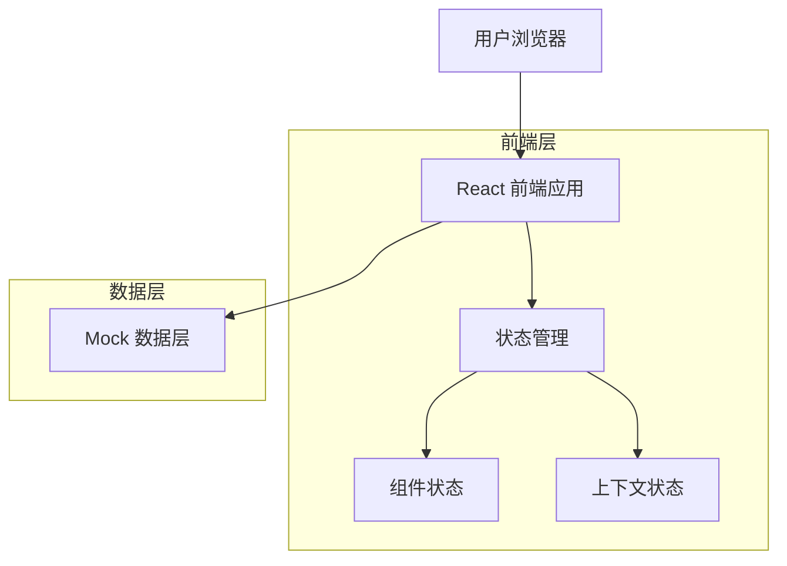
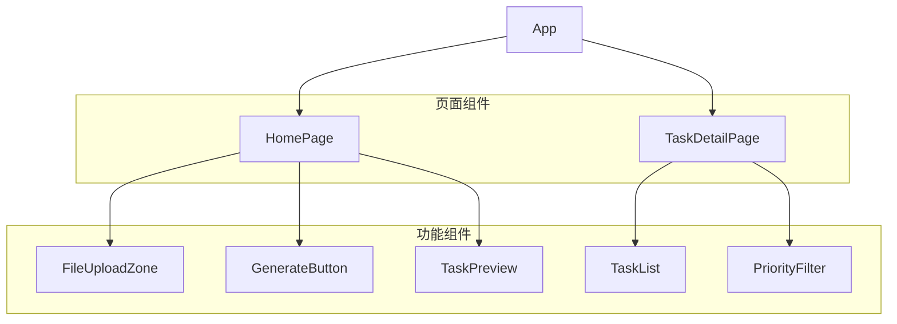

## 1. 架构设计



## 2. 技术描述

- **前端**: React@18 + Tailwind CSS@3 + Vite
- **初始化工具**: vite-init
- **图标库**: Lucide-react
- **图表库**: Chart.js (预留)
- **状态管理**: React Context + useState
- **后端**: 无 (使用 Mock 数据)
- **部署**: 静态文件托管

## 3. 路由定义

| 路由 | 用途 |
|------|------|
| / | 主页面，包含文件上传和任务生成功能 |
| /tasks | 任务详情页，展示任务列表和完成状态 |

## 4. 核心数据结构

### 4.1 任务类型定义
```typescript
interface Task {
  id: string;
  title: string;
  description: string;
  priority: 'S' | 'A' | 'B';
  completed: boolean;
  createdAt: Date;
  completedAt?: Date;
}

interface TaskState {
  tasks: Task[];
  loading: boolean;
  error: string | null;
}
```

### 4.2 上传状态类型
```typescript
interface UploadState {
  file: File | null;
  progress: number;
  status: 'idle' | 'uploading' | 'processing' | 'completed' | 'error';
  result: string | null;
}
```

### 4.3 模拟 API 响应
```typescript
interface GenerateTasksResponse {
  success: boolean;
  tasks: Task[];
  message?: string;
}
```

## 5. 组件架构



## 6. Mock 数据设计

### 6.1 模拟任务数据
```typescript
const mockTasks: Task[] = [
  {
    id: '1',
    title: '复习高等数学第三章',
    description: '重点掌握微分方程的求解方法',
    priority: 'S',
    completed: false,
    createdAt: new Date(),
  },
  {
    id: '2', 
    title: '完成英语作文练习',
    description: '写一篇关于环保的议论文，字数800字',
    priority: 'A',
    completed: false,
    createdAt: new Date(),
  },
  {
    id: '3',
    title: '整理实验报告数据',
    description: '将物理实验数据录入Excel并绘制图表',
    priority: 'B',
    completed: true,
    createdAt: new Date(),
    completedAt: new Date(),
  }
];
```

### 6.2 模拟 OCR 结果
```typescript
const mockOCRResults = [
  "期末考试复习计划：高数第三章、英语作文、物理实验报告",
  "作业清单：数学作业第15页、编程项目代码、历史论文大纲",
  "今日任务：背单词50个、跑步30分钟、阅读技术文档"
];
```

## 7. 状态管理设计

### 7.1 应用状态结构
```typescript
interface AppState {
  upload: UploadState;
  tasks: TaskState;
  ui: {
    theme: 'cyberpunk' | 'minimal';
    animations: boolean;
  };
}
```

### 7.2 Context 设计
- **UploadContext**: 管理文件上传和 OCR 模拟状态
- **TaskContext**: 管理任务列表和完成状态
- **UIContext**: 管理主题和动画设置

## 8. 工具函数

### 8.1 任务生成算法
```typescript
function generateTasksFromText(text: string): Task[] {
  // 简单的关键词匹配算法
  const keywords = {
    '考试': { priority: 'S' as const, category: '学习' },
    '作业': { priority: 'A' as const, category: '学习' },
    '运动': { priority: 'B' as const, category: '健康' }
  };
  
  // 根据关键词生成任务
  return Object.keys(keywords)
    .filter(keyword => text.includes(keyword))
    .map((keyword, index) => ({
      id: `${Date.now()}-${index}`,
      title: `完成${keyword}相关任务`,
      description: `基于识别内容生成的${keywords[keyword].category}任务`,
      priority: keywords[keyword].priority,
      completed: false,
      createdAt: new Date()
    }));
}
```

### 8.2 动画工具
```typescript
const animations = {
  pulse: 'animate-pulse',
  bounce: 'animate-bounce',
  fadeIn: 'animate-fade-in',
  slideIn: 'animate-slide-in'
};
```